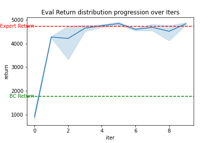
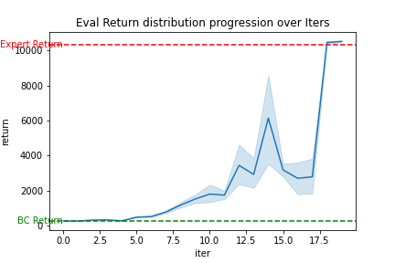

### Q1

#### part 2

##### Working Example:

CMD 

```
python cs285/scripts/run_hw1.py \
--expert_policy_file cs285/policies/experts/Ant.pkl \
--env_name Ant-v2 \
--exp_name bc_ant \
--n_iter 1 \
--expert_data cs285/expert_data/expert_data_Ant-v2.pkl \
--num_agent_train_steps_per_iter 1000 \
--eval_batch_size 5000 \
--video_log_freq 1 

```

Return distribution over 5 rollouts

| Initial_DataCollection_AverageReturn     | Eval_AverageReturn    | Eval_StdReturn |
| ------------- |:-------------:| -----:|
| 4713     | 1762 | 937 |


Video 


#### Broken Example

CMD 


```

python cs285/scripts/run_hw1.py \
--expert_policy_file cs285/policies/experts/Humanoid.pkl  \
--env_name Humanoid-v2 \
--exp_name bc_humanoid \
--n_iter 1 \
--expert_data cs285/expert_data/expert_data_Humanoid-v2.pkl \
--num_agent_train_steps_per_iter 2000 \
--eval_batch_size 5000 \
--video_log_freq 1


```

Return distribution over 100+ rollouts

| Initial_DataCollection_AverageReturn     | Eval_AverageReturn    | Eval_StdReturn |
| ------------- |:-------------:| -----:|
| 10344     | 283 | 14 |


Video 


### Part3


CMD 


```

for steps in 1000 1500 2000  2500 3000 
do
    python cs285/scripts/run_hw1.py \
    --expert_policy_file cs285/policies/experts/Ant.pkl \
    --env_name Ant-v2 \
    --exp_name bc_ant_tune_steps_per_iter \
    --n_iter 1 \
    --expert_data cs285/expert_data/expert_data_Ant-v2.pkl \
    --num_agent_train_steps_per_iter $steps \
    --eval_batch_size 5000 \
    --video_log_freq 1 
done

```

### Q2

#### Part 2


Task 1 


```
python cs285/scripts/run_hw1.py \
--expert_policy_file cs285/policies/experts/Ant.pkl \
--env_name Ant-v2 \
--exp_name dagger_ant \
--n_iter 10 \
--do_dagger --expert_data cs285/expert_data/expert_data_Ant-v2.pkl \
--eval_batch_size 5000 \
--video_log_freq 9

```




Task 2 

```
python cs285/scripts/run_hw1.py \
--expert_policy_file cs285/policies/experts/Humanoid.pkl  \
--env_name Humanoid-v2 \
--exp_name dagger_humanoid \
--n_iter 10 \
--do_dagger \
 --expert_data cs285/expert_data/expert_data_Humanoid-v2.pkl \
 --eval_batch_size 5000 \
 --video_log_freq 9

```




